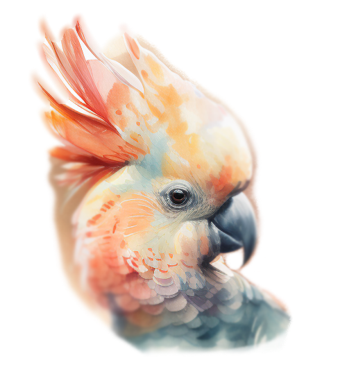

## Hi there 👋

#   Talckatoo - Chat App 

Welcome to Talckatoo, the ultimate chat app that focuses on organizing profiles! Talckatoo brings together the power of seamless communication and efficient profile management, making it the perfect platform for individuals, groups, and businesses alike.

<video autoplay muted loop id="video-bg">
    <source src="./Untitled ‑ Made with FlexClip.webm" type="video/mp4" />
</video>

## Table of Contents

- [Introduction](#introduction)
- [Features](#features)
- [Getting Started](#getting-started)
- [Installation](#installation)
- [Usage](#usage)
- [Screenshots](#screenshots)
- [Contributing](#contributing)
- [Support](#support)
- [License](#license)

## Introduction

Talckatoo is designed to streamline your chat experience by emphasizing profile organization. It allows you to create and manage distinct profiles for different purposes, enabling you to communicate with specific groups of people efficiently.

Whether you're a freelancer managing multiple clients, a team lead overseeing various projects, or an individual juggling personal and professional networks, Talckatoo has you covered!

## Features

- **Profile-based Communication:** Create and customize profiles for different contexts, keeping conversations separate and well-organized.

- **Effortless Switching:** Seamlessly switch between profiles with just a few taps or clicks, making it easy to engage with various groups of people.

- **Secure and Private:** Talckatoo prioritizes your privacy and security. All communications are end-to-end encrypted, ensuring your data remains safe.

- **Real-time Messaging:** Enjoy instant messaging with real-time message delivery, ensuring smooth and efficient conversations.

- **Media Sharing:** Share photos, videos, files, and more with your contacts directly from the app.

- **Notification Customization:** Tailor your notification settings for each profile to stay informed without being overwhelmed.

- **Cross-Platform Support:** Talckatoo is available on all major platforms, including iOS, Android, Web, and Desktop.

## Getting Started

To get started with Talckatoo, follow these simple steps:

## Installation

1. Visit our website at [www.talckatoo.com](https://www.talckatoo.com) and click on the 'Download' button.

2. Choose your platform (iOS, Android, Web, or Desktop) and follow the on-screen instructions to download the app.

3. Install the app on your device.

## Usage

1. Launch Talckatoo on your device.

2. Sign up for an account or log in if you already have one.

3. Create your first profile. You can choose a name, add a profile picture, and customize the settings according to your preferences.

4. Start adding contacts to your profile by searching for their usernames or inviting them via email or phone number.

5. Begin chatting! You can switch between profiles easily to manage different conversations.

## Video

<video autoplay muted loop id="video-bg">
    <source src="./ba55dcfb-5abc-46e7-91f8-c705bbef0f05.webm" type="video/mp4" />
</video>

## Contributing

We welcome contributions from the community to make Talckatoo even better! If you have any bug fixes, feature suggestions, or improvements, please follow our [contribution guidelines](CONTRIBUTING.md).

## Support

If you need any assistance or have questions, you can reach out to our support team at [support@talckatoo.com](mailto:support@talckatoo.com) or join our community forum [here](https://community.talckatoo.com).

## License

Talckatoo is released under the [MIT License](LICENSE).

---

Thank you for choosing Talckatoo as your go-to chat app for profile organization. We hope you have a fantastic experience using our app. If you love using Talckatoo, don't forget to spread the word and share it with your friends and colleagues! Happy chatting! 🎉
<!--

**Here are some ideas to get you started:**

🙋‍♀️ A short introduction - what is your organization all about?
🌈 Contribution guidelines - how can the community get involved?
👩‍💻 Useful resources - where can the community find your docs? Is there anything else the community should know?
🍿 Fun facts - what does your team eat for breakfast?
🧙 Remember, you can do mighty things with the power of [Markdown](https://docs.github.com/github/writing-on-github/getting-started-with-writing-and-formatting-on-github/basic-writing-and-formatting-syntax)
-->
